<!-- ============================================================= -->
<!--                    HERO — PROFILE.SYS                         -->
<!-- ============================================================= -->

  <a href="https://github.com/tothanhnguyen"><samp>GITHUB</samp></a>
  &nbsp;&nbsp;<samp>//</samp>&nbsp;&nbsp;
  <a href="mailto:tothanhnguyen2006@gmail.com"><samp>EMAIL</samp></a>
  &nbsp;&nbsp;<samp>//</samp>&nbsp;&nbsp;
  <a href="https://www.facebook.com/anhnguyengiallai/"><samp>FACEBOOK</samp></a>
  &nbsp;&nbsp;<samp>//</samp>&nbsp;&nbsp;
  <a href="https://mow-studio.vercel.app/"><samp>LIVE&nbsp;WORK&nbsp;↗</samp></a>

 

<!-- ============================================================= -->
<!--                           ABOUT                               -->
<!-- ============================================================= -->

Software Engineering student at **UIT — VNU-HCM** (K19), building full-stack products end-to-end.
I care about **clean architecture** and code that stays maintainable long after the first commit —
lately deep into **AI agent orchestration** and **microservices**.

 

<!-- ============================================================= -->
<!--                  SELECTED WORK — GIGS.SYS                     -->
<!-- ============================================================= -->

<h4><samp>GIGS.SYS — SELECTED WORK</samp></h4>

  
  

<samp>MORE —</samp>
<a href="https://github.com/tothanhnguyen/SE104_SportFieldManagement">SportFieldManagement</a> ·
<a href="https://github.com/tothanhnguyen/Mow-Studio">Mow-Studio</a> ·
<a href="https://github.com/hoangnguyen1007/Tournament-Tracker">Tournament-Tracker</a>

  

<!-- ============================================================= -->
<!--                     STACK — STACK.SYS                         -->
<!-- ============================================================= -->

<h4><samp>STACK.SYS — CYBERWARE</samp></h4>

  

<!-- ============================================================= -->
<!--                   ACTIVITY — ACTIVITY.SYS                     -->
<!-- ============================================================= -->

<h4><samp>ACTIVITY.SYS — NET TELEMETRY</samp></h4>

 

<!-- ============================================================= -->
<!--                           FOOTER                              -->
<!-- ============================================================= -->

  <samp>© 2077 THANH NGUYEN · WAKE UP, SAMURAI — WE HAVE CODE TO SHIP</samp>

